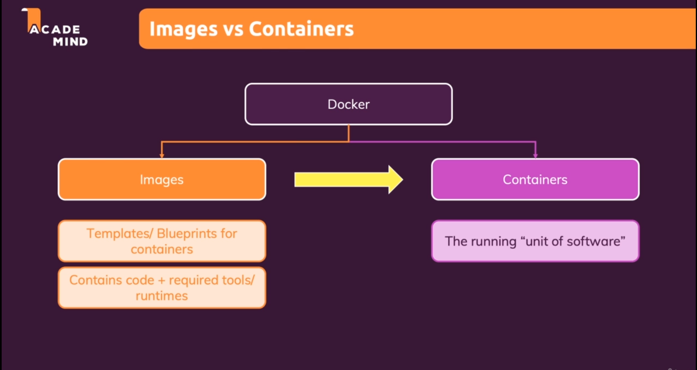

> # Docker Images
> - Docker images are the templates that contains all the requirements to run an application.
> - We can create multiple containers using single image.
> - Images are like classes and containers are objects.
> 

> - We can create docker image using pre-built or existing image and the source for that is docker hub.
 ```
  docker run [name of the image]
 ```
> - To build the image from the scratch we can first create a docker file and then build the image out of it.
```
    docker build [path_of_Dockerfile]
```
> - You need to learn how to write the Dockerfile
> - Port forwarding command
```
docker run -p [machine_port]:[docker_port]:[name_of_the_image]
```
> - If we want our container to get deleted as soon as we exit we can use the --rm flag in docker run command.
``` 
docker run -p [machine_port]:[docker_port] --rm [name_of_the_image]
```
> - Docker run command by default is in attached mode. To detach it we can use -d flag in docker run command.
```
docker run -p [machine_port]:[docker_port] --rm -d [name_of_the_image]
```
> ## Point to Note
>- The Node.js image on Docker Hub is based on the official Linux distribution from the Alpine Linux project. Alpine Linux is a lightweight distribution designed for security, simplicity, and resource efficiency.
>- When you use the FROM instruction to specify node as the base image for your Dockerfile, Docker will pull the Node.js image from Docker Hub and build your image on top of it, inheriting its underlying operating system and file system.
>- So, in summary, even though the FROM node line in your Dockerfile doesn't explicitly specify an operating system, the Node.js image that it pulls from Docker Hub is based on a Linux distribution (specifically, Alpine Linux). The WORKDIR instruction you specified in your Dockerfile will create the /app directory within this Linux filesystem.

> ## Docker image inspect
>- `Docker image inspect ` is a command that allows you to view detailed information about a Docker image. This command displays a JSON representation of the metadata associated with the image, including information 
such as the image ID, tags, labels, size, layers, and other metadata.

> ## Copying Files From & Into A Container
> ` docker cp [source] [destination]
> ## Naming and Tagging Containers & Images
> - Containers
>
```
docker run --name [name_of_the_container] [name/id of the image]
```
> - Images
```
docker build -t name:tag [location_of_dockerfile]
```

> ## Sharing Images & Containers
>- We can either share Dockerfile or we can pushing our image on Docker hub.

> ## Pushing images to Docker hub or ~~Private Registry~~
>- Pull - ` docker pull Image Name`
>- Push - ` docker push Image Name`
>- But before pushing images in the docker hub, rename your local image with the repo name of docker hub using `docker tag ` command.
```
docker tag [name_of_local_image] [name_of_docker_hub_repo]
```
> - The above command will create a copy of local docker image with the name of docker_hub_repo.

