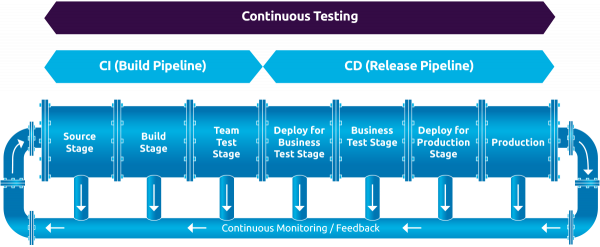

- CI/CD is a methodology of software development lifecycle (SDLC).

## Pipeline
- It is an automated process.
- A pipeline is a series of stages or steps through which data or materials pass in a defined order. The term is often used to describe a system or process where each stage is connected in sequence, with the output of one stage becoming the input of the next. In the context of computer science, a pipeline is often used to describe a series of data processing stages that are executed in sequence, such as data cleaning, transformation, and analysis. 

## Before Continous Integration
- Developer's pushes their respective in a remote repo.
- Then tester integrates the code with the environment.
- During the testing process, tester founds a bug in the code.
- Bug is again reported to the developer.
- The above process seems to be messy as developer again have to find the bug, solve it and again send it for testing.
- To resolve this process we use CI/CD.

## Using Continous Integration
- Developer's continously pushes their respective parts of code (not the complete code at once) in the remote repo.
- As soon as code is pushed in the repo, they are pulled by CI server where three processes take place, Build---Test---Deploy.
- CI/CD server then notifies the developer if their is any bug in the above three process ie build,test and deploy.
- Continous Integration = Continous Build + Continous testing


## What is Jenkins?
- Let us first analyse this familier logo

- This logo is representing the full devops lifecycle. 
- Planning and code is generally done by Github.
- Maven or gradle is used for building the application.  Build includes
```
    Complication-> Code review -> Unit testing-> Integration testing -> Packaging

```
- Selenium and JUnit is used for testing the code.
- Chef or puppet is responsible for deploy and operate.
- Monitoring is done by Nagios.
- All the above processes are in sequence.
- Plan -> Code -> Build -> Test -> Release -> Deploy -> Operate -> Monitor -> Plan ->...
- But the problem is to handle so many tools.
- This is where Jenkins come into the picture, it integrates all the tools.

- Jenkins is an open source project written in JAVA that helps to manage workflow of a project or it integrates all tools that are required for project building.
- Jenkins automate entire software development cycle.
- Whenever developer's write code, we integrate all that code of developers and further we build and test it. This process is called CI/CD.
- Jenkins works on master-slave architecture,

## Workflow of Jenkins
- We can attach git, maven, selinium and other tools with Jenkins.
- Once code is pushed to our remote repository, jenkins pull that code and send it for testing (Maven).
- Once build is done, jenkins pulls that code and send it for testing.
- Jenkins communicates with these different tools via plugins.

## Advantages of Jenkins
- Large number of plugins are available.
- We can also write our own plugin.
- Jenkins is not a tool. It is moreover a framework which is easy to customize via plugins.
- It can create labels for slave's and master.

## CI/CD pipeline project-1
- Install git 
- Install java
- 


