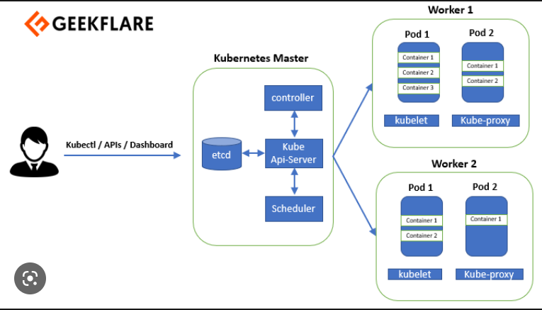

## __Architecture of kubernetes__

- It is a Master-slave architecture.
- Firstly, a user creates manifest file (yaml or json). A manifest specifies the desired state of an object that Kubernetes will maintain when you apply the manifest.
- Apply this manifest file to cluster to bring it into desired state.
- Pods runs on node which is controlled by master.

### __Role of Master Node__
- Kubernetes cluster contains containers.
- K8s designates one or more as master and other's as workers.
- The master runs set of K8s processes. These processes will ensure smooth functioning of clusters, These processes are called "Control Plane" which runs on master node.

### __Components of Control Plane (master)__
- __Kube-api-server__
    - This api-server interacts directly with user (i.e. we apply .yml or .json manifets to kube-api-server).
    - Scale automatically according as per load.
    - It acts as a frontend of control plane.

- __etcd__
    - It store's info about state of a cluster.
    - It store's metadata and status of cluster in key-value pair.
    - It is consistent and has high availability,
    - Following features of etcd :-
        - Fully Replicated - The entire state is available on every node in the cluster.
        - Secure - Implements automatic TLS with optional Client-Certificate authentication.
        - Fast - Benchmarked as 10,000 writes per second.

- __Kube schedular__(action)
    - When user make request for the creation and management of pods, kube-schedular is going to take action of these requests.
    - Kube-schedular match/assign any node to create and run pods in accordance with requirements.
    - Schedular gets the information for hardware config from config files and schedules the pods on nodes accordingly.

- __Controller Manager__
    - It makes sure that actual state matches with desired state of cluster.
    - There are two possible choices of controller-manager
        - If K8s is on the cloud, then it will be cloud controller manager.
        - If K8s is on non-cloud systems, then it will be kube-controller-manager.

## Components of Worker Node
- Each worker node has 3 components namely -
- __Kubelet__
    - It's an agent that communicates with master via API_server
    - Use port 10255
    - Send success/fail report to master

- __Container Engine__
    - Works with kubelet.
    - Pulling, creating, running images in nodes.
    - Start/Stop container.

- __Kube-proxy__
    - Assign IP to each pod.
    - It is required to assign IP address to pods(dynamic).

- __Pods__
    - Smallest unit in kubernetes.
    - Pod is a group of one or more container that are depolyed together on the same host.
    - In k8s, control unit is POD not the containers.
    - It consists of one or more  tightly coupled containers, i.e. if one of the container stops working, then other containes in the pods will stop bcoz of the fact that they are tightly coupled.

- __Multi-container-pods__
    - If there are multiple containers in a pod then they share memory space.
    - They connect to each other using localhost.
    - Share access to same volume

- __High-level-K8s-object__
    - Replication set - It's a plugin that provides auto scaling and auto healing
    - Deployment - It's a plugin that provides versioning and rollback
    - Service - It's a plugin that provides static IP addresses.
    - Volume - It's a plugin that provides that provides non-ephemeral storage